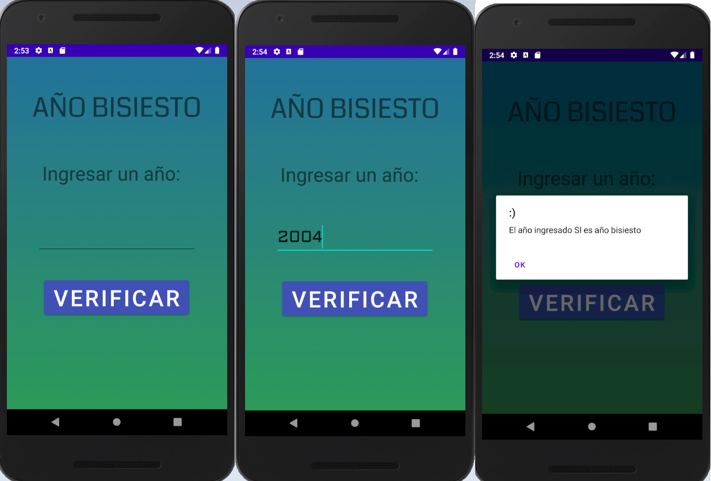

# Leap-year
Application that determines if a year is a leap year. (A year is a leap year if it is divisible by 4 and is not divisible by 100 or is divisible by 400).

1. Animacion Splash Screen de inicio:

2. Demostracion:

